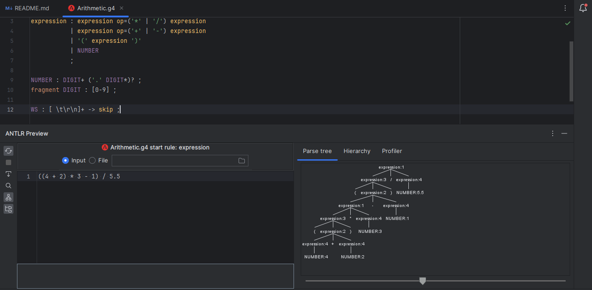

Grammar for Arithmetic Expressions
This grammar defines the structure of arithmetic expressions involving addition, subtraction, multiplication, and division operations, as well as parentheses for grouping.

Grammar Rules:
expression:

Represents an arithmetic expression.
Defined recursively to allow for complex expressions.
Can be formed by:
Combining two expression instances with an op (operator) in between.
Enclosing an expression within parentheses.
Representing a numerical value using NUMBER.
op:

Represents the operators used in arithmetic expressions.
Can be either multiplication ('*'), division ('/'), addition ('+'), or subtraction ('-').
NUMBER:

Represents a numerical value in the arithmetic expression.
Consists of one or more digits (DIGIT).
Can optionally include a decimal point ('.') and additional digits after it.
