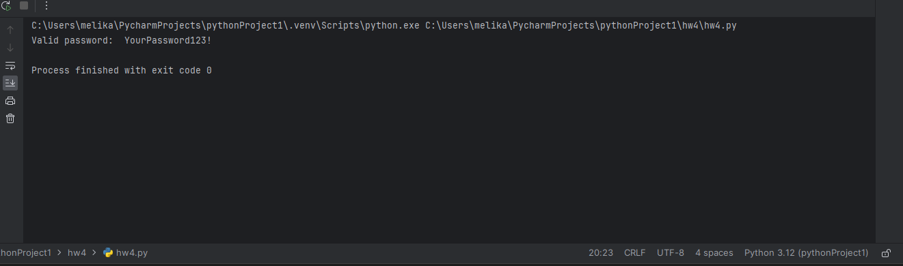

Password Validation
This project is a simple password validation tool that checks if a given password meets certain complexity requirements. It provides a Python script that reads passwords from an input file and validates each password.

Requirements
Python 3.x
Usage
Clone the repository or download the code files.

Ensure you have Python 3.x installed on your system.

Update the input.txt file with the passwords you want to validate. Each password should be on a separate line.

Open a terminal or command prompt and navigate to the project directory.
The script will read the passwords from the input.txt file and validate each one.

If a password is deemed invalid, an error message will be displayed indicating the offending password.

If all the passwords are valid, a success message will be displayed.

Customization
You can modify the is_valid_password() method in the PasswordListener class in the validate_passwords.py file to define your own password validation rules. Currently, the method implements a basic set of rules that check for:

Minimum password length of 8 characters.
Presence of at least one uppercase letter.
Presence of at least one lowercase letter.
Presence of at least one digit.
